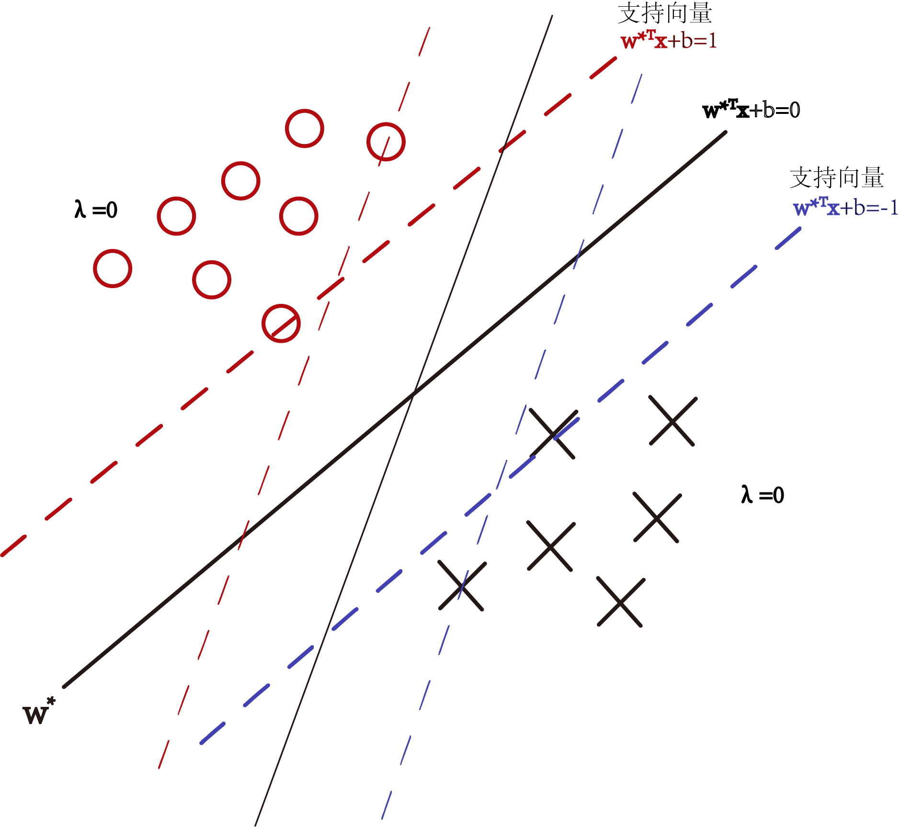

SVM有三宝，间隔，对偶，核技巧
## SVM的分类
hard-margin SVM
soft-margin SVM
kernel SVM
## SVM的背景
起初解决二分类问题
使用**超平面**
$$
\bold{w^Tx}+b
$$
将样本点分为两类
再使用符号函数
$$
f(\bold{w})=sign(\bold{w^Tx}+b)
$$
将超平面分成的两部分转化为$\{-1,1\}$中一个
SVM实际上就是一类判别模型
SVM的思想就是要找到最好的超平面$\bold{w^Tx}+b$来作为决策的边界，即找到一个**鲁棒性最好的，最中的，最大间隔分类的**超平面$\bold{w^Tx}+b$
## 最大间隔分类器
**思想：点到超平面的距离**，和最小二乘法做类比
### 记号
$$
\{(\bold{x_i},y_i)\}_{i=1}^N，\bold{x_i}\in\R^p，y_i\in \{-1,1\}\\
y取-1或者是1
$$
定义函数$margin$，其接收两个参数$\bold{w}$和$\bold{x}$表示间隔函数
$$
margin(\bold{w},b)
$$
那么就有选取$\bold{w},b$，使得间隔最大
$$
(\bold{w},b)=max margin(\bold{w},b)\\
$$
并且分类正确
$$
y_i sign(\bold{w^Tx_i}+b)>0
$$
即
$$
y_i(\bold{w^Tx_i}+b)>0，\forall i=1,2,\dots,N
$$
___
### 关于超平面
$$
\bold{w^Tx}+b=0
$$
将空间$\R^p$划分成两块，$\bold{w^Tx_i}+b$的符号就意味着点$\bold{w_i}$归属于哪一块
___
### margin间隔函数
间隔函数被定义为$N$个样本点到超平面$\bold{w}$直线的最小的那个距离
$$
\begin{aligned}
margin(\bold{w},b)&=min_{\bold{x_i},i=1,\dots,N}distance(\bold{w},b,\bold{x_i})\\
&=min_{\bold{x_i},i=1,\dots,N}\dfrac{1}{\Vert \bold{w}\Vert}\vert \bold{w^Tx_i}+b\vert
\end{aligned}
$$
因此
$$
\begin{aligned}
max \{margin(\bold{w},b)\}&=max\{min_{\bold{x_i},i=1,\dots,N}\dfrac{1}{\Vert \bold{w}\Vert}\vert \bold{w^Tx_i}+b\vert\}\\
&=max\dfrac{1}{\Vert \bold{w}\Vert}min_{\bold{x_i},i=1,\dots,N} \underbrace{y_i(\bold{w^Tx_i}+b)}_{始终>0}\\
&=max\dfrac{1}{\Vert \bold{w}\Vert}(r)\\
&等价于\rightarrow \begin{cases}max_{\bold{w},b}\dfrac{1}{\Vert \bold{w}\Vert}\\
min_{\bold{x_i},i=1,\dots,N} \underbrace{y_i(\bold{w^Tx_i}+b)}_{实际上\bold{w}和b经过缩放有无穷多个,所以限制缩放}=r=1
\end{cases}
\end{aligned}
$$
因此最后的形式就由
$$
(\bold{w},b)=max margin(\bold{w},b)\\
y_i(\bold{w^Tx_i}+b)>0，\forall i=1,2,\dots,N\tag 1
$$
变为
$$
(\bold{w},b)=min_{\bold{w},b}\Vert \bold{w}\Vert\\
\overbrace{y_i(\bold{w^Tx_i}+b)\geq 1}^{min_{\bold{x_i},i=1,\dots,N}{y_i(\bold{w^Tx_i}+b)}=1},\forall i=1,2,\dots,N\tag 2
$$
就变成一个凸优化问题
## KKT条件
KKT条件是一组必要条件，**用于判断一个点是否为约束优化问题的最优解**。对于一个约束优化问题：
最小化 $f(\bold{w},b)$ 约束问题： $\begin{cases}
min_{\bold{w},b}f(\bold{w},b)\\
g_i(\bold{w},b) ≤ 0, i = 1, 2, ..., m\\
h_j(\bold{w},b) = 0, j = 1, 2, ..., p
\end{cases}$
其中，$f(\bold{w},b)$是目标函数，$g_i(\bold{w},b)$是不等式约束，$h_j(\bold{w},b)$是等式约束。

如果$(\bold{w^\ast},b^\ast)$是最优解，那么一定满足
1.原问题的可行性条件： 
$$\begin{cases}
g_i(\bold{w^\ast},b^\ast) ≤ 0, i = 1, 2, ..., m\\
h_j(\bold{w^\ast},b^\ast) = 0, j = 1, 2, ..., p\\
\end{cases}\\
$$
2.拉格朗日乘子条件：存在**非负**的拉格朗日乘子 $λ_i$，使得满足以下条件： 
$$
\\
 ∇f(\bold{w^\ast},b^\ast) + ∑λ_i∇g_i(\bold{w^\ast},b^\ast) + ∑μ_j∇h_j(\bold{w^\ast},b^\ast) = 0\\
$$
3.互补松弛条件： 
$$
λ_ig_i(\bold{w^\ast},b^\ast) = 0, i = 1, 2, ..., m\\
$$
即解$(\bold{w^\ast},b^\ast)$满足$KKT$
$$
KKT条件： \begin{cases}λ_i ≥ 0, i = 1, 2, ..., m\\
 g_i(\bold{w^\ast},b^\ast) ≤ 0, i = 1, 2, ..., m \\
 λ_ig_i(\bold{w^\ast},b^\ast) = 0, i = 1, 2, ..., m \\
 ∇f(\bold{w^\ast},b^\ast) + ∑λ_i∇g_i(\bold{w^\ast},b^\ast) + ∑μ_j∇h_j(\bold{w^\ast},b^\ast) = 0\\
h_j(\bold{w^\ast},b^\ast) = 0, j = 1, 2, ..., p\\
\end{cases}
$$
## KKT表达
对于优化问题
$$
(\bold{w},b)=min_{\bold{w},b}\Vert \bold{w}\Vert\\
\overbrace{y_i(\bold{w^Tx_i}+b)\geq 1}^{min_{\bold{x_i},i=1,\dots,N}{y_i(\bold{w^Tx_i}+b)}=1},\forall i=1,2,\dots,N\tag 2
$$
其中的KKT表达为
$$
KKT条件：\begin{cases}
\lambda_i\geq 0\\
1-y_i(\bold{w^Tx_i}+b)\leq0\\
\lambda_i\{1-y_i(\bold{w^Tx_i}+b)\}=0\\
\nabla \dfrac{1}{2}\bold{w^Tw}+\sum\lambda_i\nabla\{1-y_i(\bold{w^Tx_i}+b)\}=0
\end{cases}
$$
## 原问题转化
使用拉格朗日数乘表示带约束的优化
$$
\clubsuit(\bold{w},b,\lambda)=\dfrac{1}{2}\bold{w^Tw}+\sum_1^N\lambda_i\underbrace{(1-y_i(\bold{w^Tx_i}+b))}_{\leq0}
$$
若限制
$$
\lambda_i\geq0
$$
那么就有
$$
max_{\lambda}\clubsuit(\bold{w},b,\lambda)=\dfrac{1}{2}\bold{w^Tw}
$$
在$\lambda_i=0$时取到最大值
所以带约束的问题
$$
(\bold{w},b)=min_{\bold{w},b}\Vert \bold{w}\Vert\\
y_i(\bold{w^Tx_i}+b)\geq 1,\forall i=1,2,\dots,N
$$
就被转化为
$$
min_{\bold{w},b}max_{\lambda}\clubsuit(\bold{w},b,\lambda)\\
\lambda_i\geq0\tag 3
$$
### 对偶
对偶问题
$$
max_{\lambda}min_{\bold{w},b}\clubsuit(\bold{w},b,\lambda)\\
\lambda_i\geq0
$$
有弱对偶关系
$$
minmax\clubsuit\geq maxmin\clubsuit
$$
总之，带约束的优化问题
$$
(\bold{w},b)=min_{\bold{w},b}\Vert \bold{w}\Vert\\
y_i(\bold{w^Tx_i}+b)\geq 1,\forall i=1,2,\dots,N
$$
不仅满足弱对偶关系，还满足强对偶关系
$$
minmax\clubsuit= maxmin\clubsuit
$$
___
### 强对偶关系
优化函数$f(\bold{p},\bold{q})$为二次式且，约束条件$g(\bold{p},\bold{q})$为线性，那么
$$
\begin{cases}
min_{\bold{q}}max_{\bold{p}}f(\bold{p},\bold{q})\\
g(\bold{p},\bold{q})=0
\end{cases}\Leftrightarrow\begin{cases}
=max_{\bold{p}}min_{\bold{q}}f(\bold{p},\bold{q})\\
g(\bold{p},\bold{q})=0
\end{cases}
$$
即满足强对偶关系
___
因此，问题
$$
min_{\bold{w},b}max_{\lambda}\clubsuit(\bold{w},b,\lambda)\\
\lambda_i\geq0
$$
等价于
$$
\begin{cases}
max_{\lambda}\underbrace{min_{\bold{w},b}\clubsuit(\bold{w},b,\lambda)}_{这就是一个无约束问题}\\
\lambda_i\geq0
\end{cases}\tag 4
$$
**所以将一个带有$N$个约束条件的优化问题转化为了一个无约束的问题**
## 优化
$$
\dfrac{\partial \clubsuit}{\partial b}=0\rightarrowtail\sum_1^N\lambda_iy_i=0\\
$$
代入$\clubsuit$得到$\clubsuit'$
$$
\dfrac{\partial \clubsuit'}{\partial \bold{w}}=\bold{0}\rightarrowtail\bold{\hat w}=\sum_1^N\lambda_iy_i\bold{x_i}
$$
再带入$\clubsuit'$得到$\clubsuit''$
因此
$$
min_{\bold{w},b}\clubsuit=\clubsuit''=-\dfrac{1}{2}\sum_{i=1}^N\sum_{j=1}^N\lambda_i\lambda_jy_i y_j\bold{x_i^Tx_j}+\sum_{i=1}^N\lambda_i
$$
所以问题就变为
$$
\begin{cases}
max_{\lambda}\left\{-\dfrac{1}{2}\sum_{i=1}^N\sum_{j=1}^N\lambda_i\lambda_jy_i y_j\bold{x_i^Tx_j}+\sum_{i=1}^N\lambda_i\right\}\\
\lambda_i\geq0\\
\sum_1^N\lambda_iy_i=0\\
\bold{\hat w}=\sum_1^N\lambda_iy_i\bold{x_i}
\end{cases}\tag 5
$$
## 利用KKT求解
优化问题
$$
KKT条件：\begin{cases}
\lambda_i\geq 0\\
1-y_i(\bold{w^Tx_i}+b)\leq0\\
\lambda_i\{1-y_i(\bold{w^Tx_i}+b)\}=0\\
\nabla \dfrac{1}{2}\bold{w^Tw}+\sum\lambda_i\nabla\{1-y_i(\bold{w^Tx_i}+b)\}=0
\end{cases}
$$
等价于
$$
\begin{cases}
max_{\lambda}\left\{-\dfrac{1}{2}\sum_{i=1}^N\sum_{j=1}^N\lambda_i\lambda_jy_i y_j\bold{x_i^Tx_j}+\sum_{i=1}^N\lambda_i\right\}\\
\lambda_i\geq0\\
\sum_1^N\lambda_iy_i=0\\
\bold{\hat w}=\sum_1^N\lambda_iy_i\bold{x_i}
\end{cases}
$$
很明显
$$
\bold{w^\ast}=\bold{\hat w}=\sum_1^N\lambda_iy_i\bold{x_i}
$$
### 支持向量与b
根据互补松弛条件
$$
\lambda_i\{1-y_i(\bold{w^Tx_i}+b)\}=0
$$
$(\bold{w^\ast},b)$是最优解就满足
$$
\lambda_i\{1-y_i(\bold{w^{\ast T}x_i}+b^\ast)\}=0
$$
有
$$
\lambda_i=0
$$
或者
$$
1-y_i(\bold{w^{\ast T}x_i}+b^\ast)=0
$$
由于$\bold{w^\ast}=\sum_1^N\lambda_iy_i\bold{x_i}$，因此$\lambda_i=0$的样本点对$\bold{w^{\ast}}$毫无贡献
所以考虑
$$
1-y_i(\bold{w^{\ast T}x_i}+b^\ast)=0
$$
有两个超平面满足条件
$$
\begin{cases}
\bold{w^{\ast T}x}+b^\ast=1，y_i=1\\
\bold{w^{\ast T}x}+b^\ast=-1，y_i=-1
\end{cases}
$$
所以，必存在样本点$\bold{x_p}$和$\bold{x_q}$，满足
$$
\begin{cases}
\bold{w^{\ast T}x_p}+b^\ast=1，y_i=1\\
\bold{w^{\ast T}x_q}+b^\ast=-1，y_i=-1
\end{cases}
$$
所以有
$$
b^\ast=1-\bold{w^{\ast T}x_p}=-1-\bold{w^{\ast T}x_q}
$$

因此$\bold{w^{\ast}}$是在支持向量上的样本点的线性组合，不在支持向量上的点对$\bold{w^{\ast}}$无关